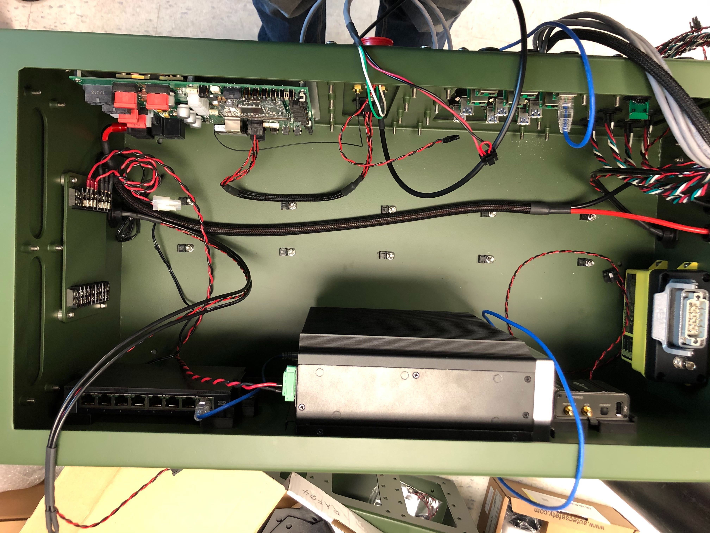

Keeping Moose Updated
======================

Moose is always being improved, both its own software and the many community ROS packages upon which it
depends! You can use the apt package management system to receive new versions all software running on the
platform.

Getting New Packages
--------------------

Each Moose leaves the factory already configured to pull packages from http://packages.ros.org as well as
http://packages.clearpathrobotics.com. To update your package and download new package versions make sure that
Moose is connected to the internet and run the following commands:

.. code-block:: bash

    sudo apt-get update
    sudo apt-get dist-upgrade

If you see any errors, please `get in touch`_ and we'll see if we can get you sorted out.

.. _get in touch: https://support.clearpathrobotics.com/hc/en-us/requests/new

MCU Firmware Update
-------------------

You need to use an external PC to update Moose's MCU firmware.  You cannot use Moose's internal PC, as installing the
firmware requires power-cycling the MCU.  Moose's MCU controls the power supply to the internal PC.  These instructions
assume the external PC is running some flavour of Linux with access to Clearpath's ROS packages.

When you update packages, there is periodically a new version of Moose's firmware available. You will know this
is the case in one of two ways:

1. The firmware and PC are unable to connect to each other, which will be apparent if Moose's heartbeat LED does not flash
   continuously while the robot is powered on; or
2. If the firmware version number in the ``/status`` message does not match the package version output by
   |dpkg_s_firmware|. In the future there will be an automated check for this which outputs
   a diagnostics warning when a firmware update is available to be applied.

If new firmware is available, follow the below procedure to flash it to Moose's MCU:

1. Place Moose up on blocks and/or engage the emergency stop by pressing one of the red buttons located on each corner
   of the robot. Firmware loading does not usually result in unintended motion, but it's safest to ensure the robot
   cannot move accidentally.
2. Open Moose's computer box, located on the rear of the robot

3. Download the Warthog firmware package onto your PC:

.. substitution-code-block:: bash

    sudo apt-get install ros-|ros_distro|-moose-firmware

4. While pressing ``BT0`` on the MCU, connect the external PC to Moose's MCU using a USB cable.

.. image:: graphics/moose_mcu_buttons.jpg
    :alt: Moose's MUC's buttons

5. After connecting the PC you should see a device with a name similar to
   ``Bus 001 Device 005: ID 0483:df11 STMicroelectronics STM Device in DFU Mode`` in the output of ``lsusb``.  Run the
   following command, replacing ``001/005`` with the value appropriate to the Bus and Device where Moose's MCU is
   connected:

.. code-block:: bash

    sudo chmod 666 /dev/bus/usb/001/005

Now run the following command to upload the firmware:

.. substitution-code-block:: bash

    dfu-util -v -d 0483:df11 -a 0 -s 0x08000000 -D /opt/ros/|ros_distro|/share/moose_firmware/mcu.bin

You should see about 20 seconds worth of lines output beginning with "Download from image ...". When this is
complete you may disconnect the PC from the MCU and power-cycle the robot.

.. _scratch:

Starting From Scratch
---------------------

If Moose's computer has become inoperable, or for any reason you want to restore it to the factory state, begin
by opening Moose's computer box, located on the rear of the robot.  The PC is easily accessible with USB, network,
and video ports available.

1. Download the latest operating system image for Moose from http://packages.clearpathrobotics.com/stable/images/latest/
2. Use unetbootin__ or rufus__ (Windows only) to write the ISO image to a USB memory stick

.. _unetbootin: https://unetbootin.github.io/linux_download.html
__ unetbootin_

.. _rufus: https://rufus.ie/
__ rufus_

3. Connect Moose's PC to the internet with an ethernet cable.  Also connect a monitor, mouse, and keyboard to the PC.
4. Connect Moose to shore power to ensure it does not power down while the OS is installing.  This is optional, but
   recommended.
5. Insert the USB drive into one of the Moose's PC's USB ports and power-cycle the PC.  You should see a purple
   Debian/Ubuntu installer.  The installer will run by itself and power off the PC when finished.  If you do
6. Remove the USB drive and power on the PC.
7. Log into Moose.  The username is ``administrator`` and the password is ``clearpath``
8. Install Moose's robot_upstart__ job, so that ROS will launch each time the robot starts:

.. _robot_upstart: http://wiki.ros.org/robot_upstart
__ robot_upstart_

.. code-block bash

    rosrun moose_bringup install

You can now configure Moose to :doc:`connect to your wi-fi <MooseNetwork>`.
