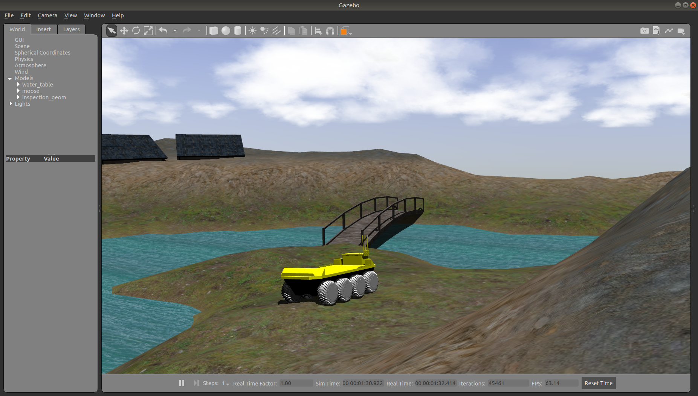
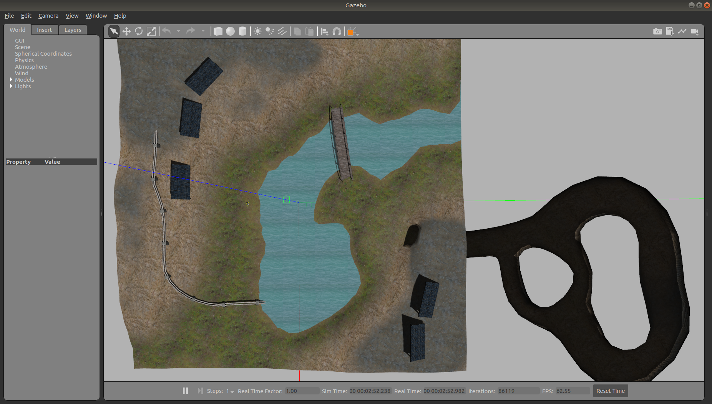
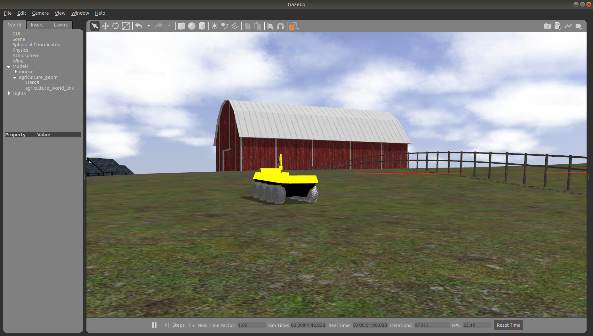
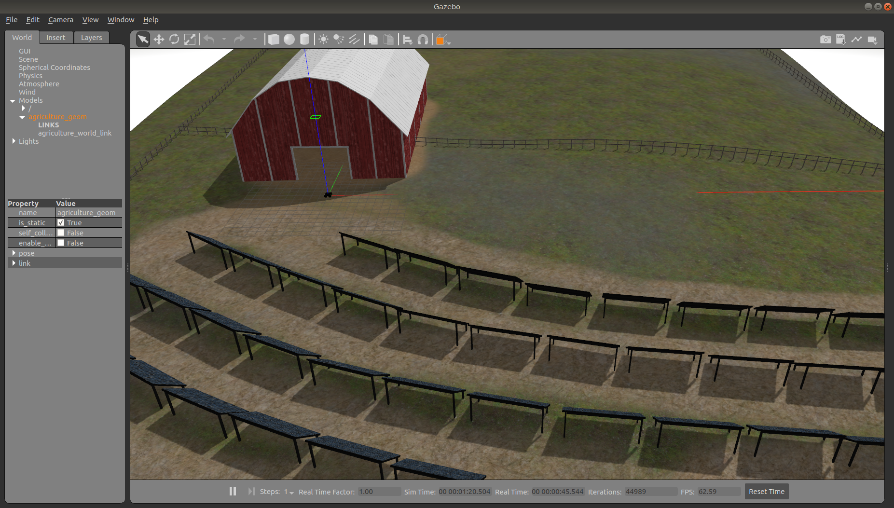
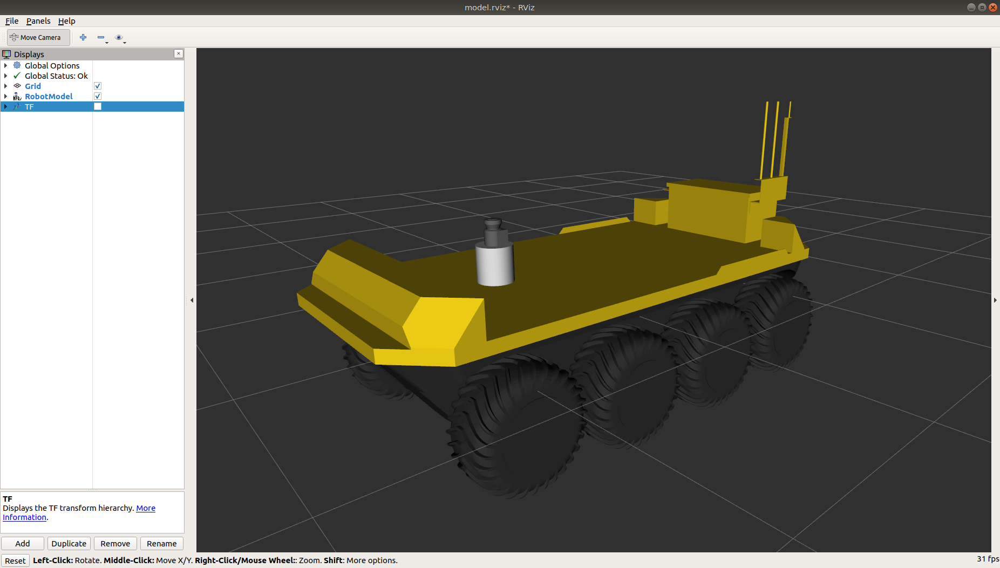
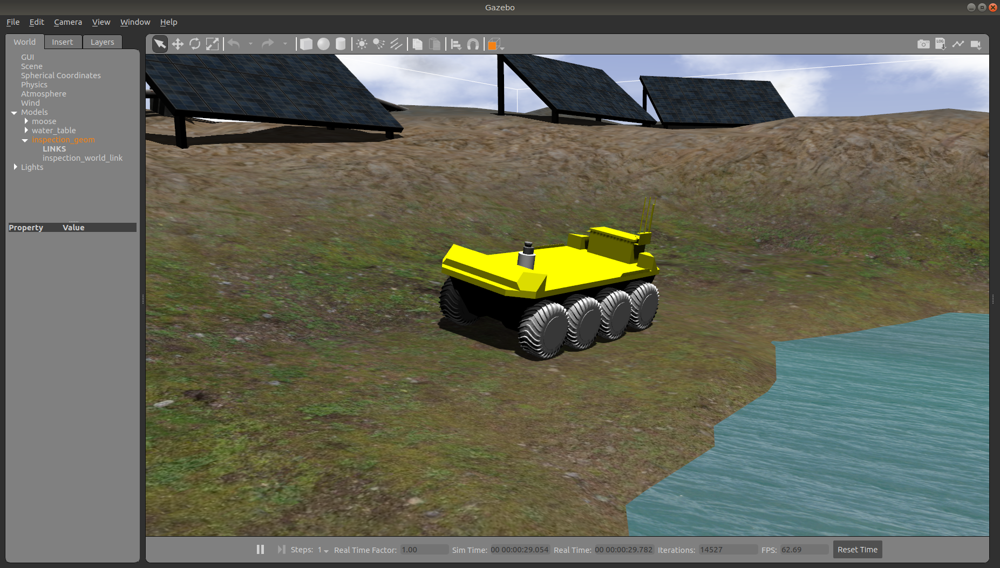

Additional Simulation Worlds
================================

In addtion to the default ``moose_world.launch`` file, ``moose_gazebo`` also contains ``spawn_moose.launch``,
which is intended to be included in any custom world to add a Moose simulation to it.

To add a Moose to any of your own worlds, simply include the ``spawn_moose.launch`` file in your own world's launch:

.. code-block:: xml

  <include file="$(find moose_gazebo)/launch/spawn_moose.launch">
    <!-- Optionally configure the spawn position -->
    <arg name="x" value="$(arg x)"/>
    <arg name="y" value="$(arg y)"/>
    <arg name="z" value="$(arg z)"/>
    <arg name="yaw" value="$(arg yaw)"/>
  </include>

Clearpath also provides an additional suite of simulation environments that can be downloaded separately and used
with Moose, as described below.

Clearpath Gazebo Worlds
------------------------

The Clearpath Gazebo Worlds collection contains 4 different simulation worlds, representative of different
environments our robots are designed to operate in:

* Inspection World: a hilly outdoor world with water and a cave
* Agriculture World: a flat outdoor world with a barn, fences, and solar farm
* Office World: a flat indoor world with enclosed rooms and furniture
* Construction World: office world, under construction with small piles of debiris and partial walls

Moose is supported in Inspection World and Agriculture World.

Installation
---------------

To download the Clearpath Gazebo Worlds, clone the repository from github into the same workspace as your Moose:

.. code-block:: bash

  cd ~/catkin_ws/src
  git clone https://github.com/clearpathrobotics/cpr_gazebo.git

Before you can build the package, make sure to install dependencies.  Because Clearpath Gazebo Worlds depends on
all of our robots' simulation packages, and some of these are currently only available as source code, installing
dependencies with ``rosdep install --from-paths [...]`` will likely fail.

All four simulation environments need the ``gazebo_ros`` package.  The Inspection World also needs the ``uuv_gazebo_worlds``
package, which can be installed by running

.. code-block:: bash

  sudo apt-get install ros-$ROS_DISTRO-uuv-gazebo-worlds

Once the dependencies are installed, you can build the package:

.. code-block:: bash

  cd ~/catkin_ws
  catkin_make
  source devel/setup.bash

Running the Inspection Simulation
------------------------------------

Inspection World is a hilly, outdoor world that includes a water feature, bridge, pipeline, small cave/mine,
and a small solar farm.  It is intended to simulate a variety of missions, including pipeline inspection,
cave/underground navigation, and localization on non-planar terrain.

To launch the inspection simulation, run

.. code-block:: bash

  roslaunch cpr_inspection_gazebo inspection_world.launch platform:=moose

To customize Moose's payload, for example to add additional sensors, see :ref:`customizepayload`.

Once the simulation is running you can use rviz and other tools as described in :doc:`MooseSimulation`
to control and monitor the robot.

You can see the complete layout of the Inspection World below:

Running the Agriculture Simulation
------------------------------------

Agriculture World is a flat, mixed indoor/outdoor world that include a large barn, open fields surrounded by fences,
and a large solar farm.  It is intended to simulate missions such as solar panel inspection and area coverage.

To launch the agriculture simulation, run

.. code-block:: bash

  roslaunch cpr_agriculture_gazebo agriculture_world.launch platform:=moose

To customize Moose's payload, for example to add additional sensors, see :ref:`customizepayload`.

Once the simulation is running you can use rviz and other tools as described in :doc:`MooseSimulation`
to control and monitor the robot.

.. _customizepayload:

Customizing Moose's Payload
-------------------------------

To customize Moose's payload you must use the environment variables described in :doc:`MoosePackages`.  You can add
additional sensors by creating a customized URDF and setting the ``MOOSE_URDF_EXTRAS`` environment variable to point to it.

For example, let's suppose you want to equip your Moose with one LMS-1xx lidar sensor mounted toward the front of the
robot.

First install the ``lms1xx`` package, along with the gazebo plugins to simulate the lidar sensor:

.. code-block bash::

  sudo apt-get install ros-$ROS_DISTRO-lms1xx ros-$ROS_DISTRO-gazebo-plugins

Then create the file ``$HOME/Desktop/moose-sensors.urdf.xacro`` and put the following in it:

.. code-block:: xml

  <?xml version="1.0"?>
  <robot xmlns:xacro="http://www.ros.org/wiki/xacro">

    <!-- create a simple platform for the lidar -->
    <link name="lidar_mount">
      <visual>
        <origin xyz="0 0 0" rpy="0 0 0" />
        <geometry>
          <cylinder radius="0.1" length="0.4" />
        </geometry>
        <material name="white">
          <color rgba="1.0 1.0 1.0 1.0" />
        </material>
      </visual>
      <collision>
        <origin xyz="0 0 0" rpy="0 0 0" />
        <geometry>
          <cylinder radius="0.1" length="0.4" />
        </geometry>
      </collision>
    </link>
    <joint name="lidar_mount_joint" type="fixed">
      <parent link="top_chassis_link" />
      <child link="lidar_mount" />
      <origin xyz="0.7 0 0" rpy="0 0 0" />
    </joint>

    <!-- add the lidar unit to the base -->
    <xacro:include filename="$(find lms1xx)/urdf/sick_lms1xx.urdf.xacro" />
    <xacro:sick_lms1xx frame="front_laser" topic="/front/scan" />
    <joint name="front_laser_joint" type="fixed">
      <parent link="lidar_mount" />
      <child link="front_laser" />
      <origin xyz="0 0 0.3" rpy="0 0 0" />
    </joint>
  </robot>

To check that your sensors are added correctly, run

.. code-block:: bash

  export MOOSE_URDF_EXTRAS=$HOME/Desktop/moose-sensors.urdf.xacro
  roslaunch moose_viz view_model.launch

You should see the moose with a cyinder and the lidar unit on top of it:

Similarly, you can use your customized Moose in simulations:

.. code-block:: bash

  export MOOSE_URDF_EXTRAS=$HOME/Desktop/moose-sensors.urdf.xacro
  roslaunch cpr_inspection_gazebo inspection_world.launch platform:=moose

The lidar data is published to the ``/front/scan`` topic.

