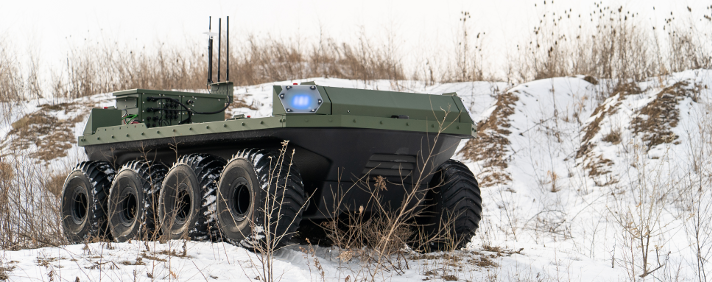

Moose UGV Tutorials
======================

This package supplies Sphinx-based tutorial content to assist you with setting up and operating your Moose_
mobile robot. The tutorials topics are listed in the left column, and presented in the suggested reading order.

.. _Moose: http://www.clearpathrobotics.com/moose/

:doc:`Simulation <MooseSimulation>` is a logical place for most users to start, as this is universally applicable;
understanding how to effectively operate Moose in simulation is valuable whether you are in the testing
phase with software you intend to ultimately deploy on a real Moose, or you do not have one and are
simply exploring the platform's capabilities.

:doc:`Driving <MooseDriving>` covers how to teleoperate Moose using the remote control, a well as safety procedures
for operating the real robot.  Anyone working with a physical robot should be familiar with this section.

The remainder of the subjects are more applicable to the real robot, and have to do with configuring, using,
and maintaining the platform. If you are a lab administrator rather than direct platform user, you may wish to
skip the introductory chapters and jump straight to these ones.

.. toctree::
    :maxdepth: 3
    :caption: Contents

    Overview <self>
    MooseInstallation
    MooseSimulation
    MooseDriving
    MooseNetwork
    MooseStartup
    MooseUpdate

.. toctree::
    :titlesonly:
    :hidden:
    :caption: Moose Packages

    MoosePackages
